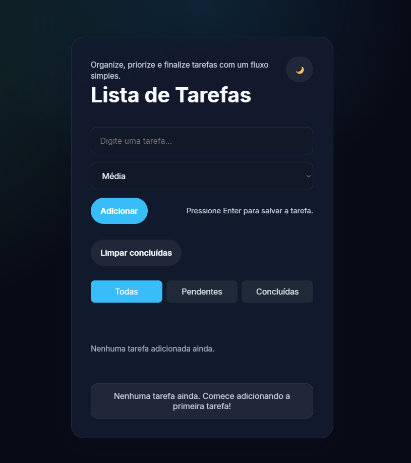

# 🚀 To-Do List App

Aplicação web moderna de gerenciamento de tarefas com foco em experiência do usuário, organização de código e interatividade.

## ✨ Funcionalidades

- ✅ Criação, edição e exclusão de tarefas
- 📌 Sistema de prioridade (alta, média, baixa)
- 🔄 Drag and Drop para reorganização
- 🌙 Dark / Light Mode
- 🔍 Filtros de tarefas
- 💾 Persistência com localStorage

## 🛠 Tecnologias

- HTML5
- CSS3
- JavaScript ES6+

## 🎯 Diferenciais

- Arquitetura baseada em estado (state management)
- Manipulação avançada do DOM
- Interface moderna e responsiva
- Experiência de usuário otimizada

## 🔗 Acesso

()

## 📸 Preview

  

## 📚 Aprendizados

## Aprendizados

Durante o desenvolvimento deste projeto, aprofundei meus conhecimentos em:

- Estruturação de aplicações frontend com JavaScript Vanilla
- Manipulação dinâmica do DOM
- Gerenciamento de estado da aplicação
- Persistência de dados utilizando localStorage
- Criação de filtros dinâmicos
- Implementação de Drag and Drop
- Dark/Light Mode com persistência de tema
- Event Delegation para melhorar performance
- Organização e modularização de código
- Criação de componentes reutilizáveis
- Responsividade com Flexbox e Media Queries
- Animações e microinterações com CSS
- Clean Code e separação de responsabilidades
- Manipulação de eventos complexos
- Estruturação de arquitetura frontend escalável
- Boas práticas de UX/UI
- Acessibilidade básica em aplicações web
- Performance e otimização de renderização
- Uso moderno de ES6+
- Estruturação de projetos para portfólio profissional

## Evolução Técnica

Este projeto foi importante para evoluir minha visão sobre:

- Arquitetura frontend
- Escalabilidade de aplicações
- Organização de código
- Experiência do usuário
- Componentização
- Performance no frontend
- Estruturação de projetos reais
- Boas práticas modernas de desenvolvimento
